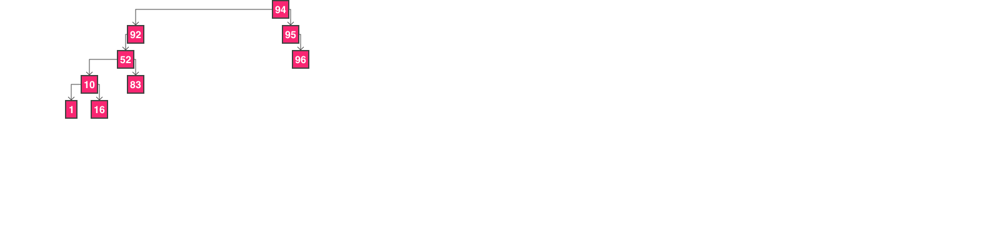

# print-tree
In terminal print tree data structure

在学习数据结构中，二叉树显然是个非常重要的知识点，为了更方便的查看一个二叉树的结构，所以基于`node-canvas`、`erminal-image`绘制出可视化的二叉树到控制台中，便于学习理解二叉树的一些算法。

## 使用

``` shell
yarn add print-trees # or npm install print-trees
```

## Example

``` js
const { BinaryTreeInfo } = require('../')
class Node {
  constructor(element, left=null, right=null, parent=null) {
    this.element = element
    this.left = left
    this.right = right
    this.parent = parent
  }
}
const root = new Node(1)
root.left = new Node(2)
root.right = new Node(3)
root.left.left = new Node(4)
root.left.right = new Node(5)
root.right.left = new Node(6)
root.right.right = new Node(7)
class Tree {
  constructor(root) {
    this.root = root
  }
  getRoot() {
    return this.root
  }
  getLeft(node) {
    return node.left
  }
  getRight(node) {
    return node.right
  }
}
BinaryTreeInfo.print(new Tree(root), {
  canvasWidth: 600,
  canvasHeight: 300,
})

```

> 运行效果

